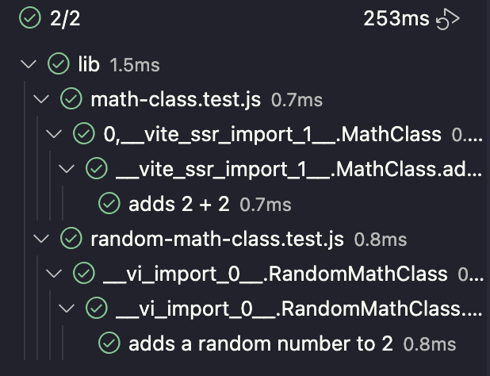
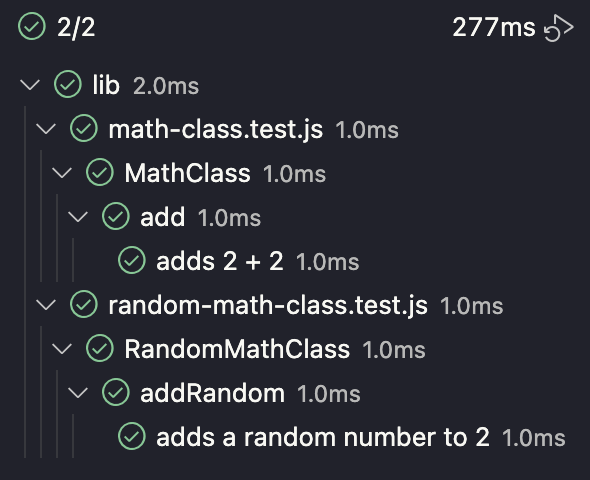

# vitest-test-name-issue-repro

This is a repro repository to demonstrate an issue with the Vitest VSCode Extension where names in the Testing panel appear to be using a build-internal label (`0,__vite_ssr__import_*__`) instead of the plain name of the identifier supplied.

This happens specifically when an identifier is passed into `describe`:

```js
describe(MathClass, () => {
  describe(MathClass.add, () => {
    it('adds 2 + 2', () => {
      const expected = 4;

      const actual = MathClass.add(2, 2);

      expect(actual).toBe(expected);
    })
  });
});
```

There is also a different internal label (`__vi_import_*__`) used when the test includes a mock:

```js
import { rng as _rng } from './rng.js';
vi.mock('./rng.js');
const rng = vi.mocked(_rng);

describe(RandomMathClass, () => {
  describe(RandomMathClass.addRandom, () => {
    beforeEach(() => {
      rng.mockReturnValue(3);
    });

    afterEach(() => {
      vi.resetAllMocks();
    });

    it('adds a random number to 2', () => {
      const expected = 5;

      const actual = RandomMathClass.addRandom(2);

      expect(actual).toBe(expected);
    })
  });
});
```

# Setup

```sh
$ npm install
```

# Repro

1. Open this repo in VSCode.
1. Make sure that the Vitest extension is installed.
1. Go to the **Testing** tab.
1. Expand `lib` and `math-class.test.js`

## Observed behavior

For `MathClass`:
- The describe block is labelled `0,__vite_ssr_import_1__.MathClass`
- The describe block inside that is labelled `0,__vite_ssr_import_1__.MathClass.add`

For `RandomMathClass`:
- The describe block is labelled `__vi_import_0__.RandomMathClass`
- The describe block inside that is labelled `__vi_import_0__.RandomMathClass.addRandom`

## Expected behavior

For `MathClass`:
- The describe block is labelled `MathClass`
- The describe block inside that is labelled `MathClass.add`

For `RandomMathClass`:
- The describe block is labelled `RandomMathClass`
- The describe block inside that is labelled `RandomMathClass.randomAdd`

## Screenshots

After a refresh:



After testing:



## Further notes
The testing tab has labels as expected after tests are run (in VSCode), but they reset if the **Refresh Tests** button is clicked.